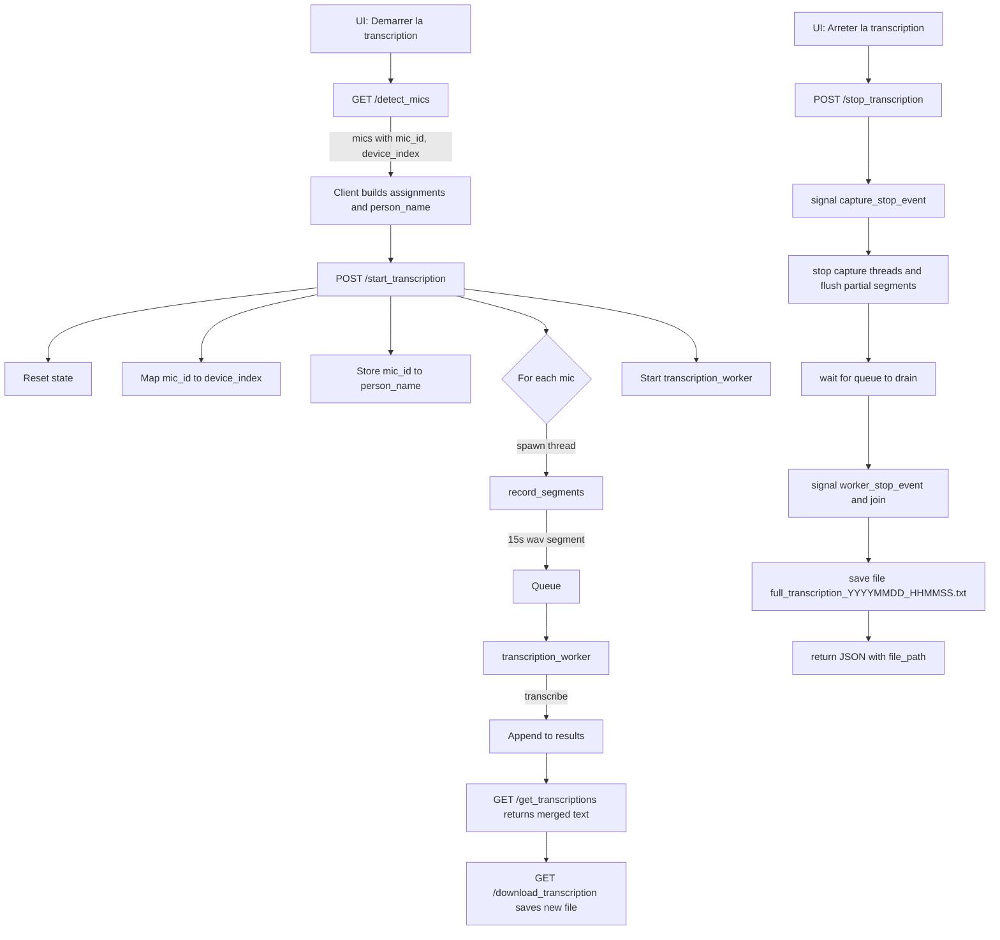

Parfait, je te prépare un guide complet et concret étape par étape avec un prototype Python + Flask adapté à ton Raspberry Pi 5.

---

# Guide complet setup Raspberry Pi 5 — Multi-mic USB mobile + transcription Whisper base multilingue auto + fusion chronologique + API Flask

---

## 1. Installation des dépendances sur le Raspberry Pi

```bash
sudo apt update && sudo apt upgrade -y
sudo apt install ffmpeg libsndfile1 python3-pip -y
pip3 install --upgrade pip
pip3 install torch torchvision torchaudio --index-url https://download.pytorch.org/whl/cpu
pip3 install git+https://github.com/openai/whisper.git
pip3 install sounddevice flask
```

---

## 2. Script Python principal (`transcribe_multimic.py`)

```python
import subprocess
import threading
import queue
import sounddevice as sd
import numpy as np
import wave
import time
import os
import whisper
from flask import Flask, request, jsonify, send_file
from datetime import datetime

app = Flask(__name__)

# Global variables pour stocker l’état
recording_threads = []
transcription_results = []
stop_event = threading.Event()

# Queue pour communication entre thread capture et transcription
audio_queue = queue.Queue()

# Chargement modèle Whisper une fois au démarrage
model = whisper.load_model("base")

# Fonction pour détecter les micros USB (carte ALSA)
def detect_mics():
    result = subprocess.run(['arecord', '-l'], capture_output=True, text=True)
    lines = result.stdout.split('\n')
    mics = []
    for line in lines:
        if 'card' in line and 'USB' in line:
            parts = line.split()
            card_index = None
            device_index = None
            for i, part in enumerate(parts):
                if part == 'card':
                    card_index = parts[i+1].strip(':')
                if part == 'device':
                    device_index = parts[i+1].strip(':')
            if card_index is not None and device_index is not None:
                mics.append((int(card_index), int(device_index)))
    return mics

# Fonction pour enregistrer par segments de 30s avec horodatage et placer dans queue
def record_segments(card, device, mic_id, segment_duration=30, fs=16000):
    device_name = f"hw:{card},{device}"
    print(f"[{mic_id}] Démarrage capture segmentée sur {device_name}")
    while not stop_event.is_set():
        timestamp = datetime.utcnow().strftime("%Y%m%d_%H%M%S_%f")
        filename = f"audio_{mic_id}_{timestamp}.wav"
        try:
            recording = sd.rec(int(segment_duration * fs), samplerate=fs, channels=1, dtype='int16', device=device_name)
            sd.wait()
            with wave.open(filename, 'wb') as wf:
                wf.setnchannels(1)
                wf.setsampwidth(2)
                wf.setframerate(fs)
                wf.writeframes(recording.tobytes())
            print(f"[{mic_id}] Segment enregistré : {filename}")
            audio_queue.put((mic_id, filename, timestamp))
        except Exception as e:
            print(f"[{mic_id}] Erreur enregistrement : {e}")
            break
    print(f"[{mic_id}] Fin capture")

# Thread transcription : récupère fichiers depuis queue, transcrit, stocke résultats
def transcription_worker():
    while not stop_event.is_set() or not audio_queue.empty():
        try:
            mic_id, filename, timestamp = audio_queue.get(timeout=1)
        except queue.Empty:
            continue
        print(f"[Transcription] Traitement {filename} (Micro {mic_id})")
        try:
            result = model.transcribe(filename, language=None)  # Auto détection
            text = result['text'].strip()
            # Stocker dans global (thread safe ? ici simplifié)
            transcription_results.append({
                "mic_id": mic_id,
                "timestamp": timestamp,
                "text": text
            })
            print(f"[Transcription] Texte {mic_id} @ {timestamp}: {text}")
        except Exception as e:
            print(f"[Transcription] Erreur transcription {filename}: {e}")
        finally:
            # Supprimer fichier audio après transcription pour économiser place
            if os.path.exists(filename):
                os.remove(filename)
        audio_queue.task_done()
    print("[Transcription] Thread terminé")

# Endpoint API Flask

@app.route('/detect_mics', methods=['GET'])
def api_detect_mics():
    mics = detect_mics()
    # Retourner liste indexée pour assignation dans UI
    data = [{"mic_id": idx+1, "card": c, "device": d} for idx, (c, d) in enumerate(mics)]
    return jsonify({"mics": data})

@app.route('/start_transcription', methods=['POST'])
def api_start_transcription():
    global recording_threads, transcription_results, stop_event
    if recording_threads:
        return jsonify({"status": "error", "message": "Transcription déjà en cours"}), 400

    content = request.json
    # Exemple de payload attendu : { "assignments": [{"mic_id":1, "person_name":"Alice"}, ...]}
    assignments = content.get("assignments", [])
    if not assignments:
        return jsonify({"status": "error", "message": "Pas d'assignation fournie"}), 400

    stop_event.clear()
    transcription_results.clear()
    recording_threads = []

    # Détecter micros disponibles (carte ALSA)
    mics = detect_mics()
    mic_map = {idx+1: (c, d) for idx, (c, d) in enumerate(mics)}

    # Lancer capture segmentée sur chaque micro assigné
    for a in assignments:
        mic_id = a['mic_id']
        if mic_id not in mic_map:
            return jsonify({"status": "error", "message": f"Mic ID {mic_id} non détecté"}), 400
        c, d = mic_map[mic_id]
        t = threading.Thread(target=record_segments, args=(c, d, mic_id))
        t.start()
        recording_threads.append(t)

    # Lancer thread transcription
    t_trans = threading.Thread(target=transcription_worker)
    t_trans.start()
    recording_threads.append(t_trans)

    return jsonify({"status": "started", "message": f"Transcription démarrée pour {len(assignments)} micros"})

@app.route('/stop_transcription', methods=['POST'])
def api_stop_transcription():
    global stop_event, recording_threads
    stop_event.set()
    for t in recording_threads:
        t.join()
    recording_threads.clear()
    return jsonify({"status": "stopped"})

@app.route('/get_transcriptions', methods=['GET'])
def api_get_transcriptions():
    # Fusionner les résultats par timestamp global
    sorted_transcripts = sorted(transcription_results, key=lambda x: x['timestamp'])
    # Formatage texte fusionné
    full_text = ""
    for tr in sorted_transcripts:
        dt = datetime.strptime(tr['timestamp'], "%Y%m%d_%H%M%S_%f")
        timestamp_str = dt.strftime("%H:%M:%S")
        full_text += f"[{timestamp_str}] Micro {tr['mic_id']}: {tr['text']}\n"
    return jsonify({"transcription": full_text})

@app.route('/download_transcription', methods=['GET'])
def api_download_transcription():
    sorted_transcripts = sorted(transcription_results, key=lambda x: x['timestamp'])
    filename = "full_transcription.txt"
    with open(filename, "w", encoding="utf-8") as f:
        for tr in sorted_transcripts:
            dt = datetime.strptime(tr['timestamp'], "%Y%m%d_%H%M%S_%f")
            timestamp_str = dt.strftime("%H:%M:%S")
            f.write(f"[{timestamp_str}] Micro {tr['mic_id']}: {tr['text']}\n")
    return send_file(filename, as_attachment=True)

if __name__ == '__main__':
    app.run(host='0.0.0.0', port=5000)
```

---

## 3. Utilisation côté UI (Flask + JS)

* Quand tu cliques sur "démarrer la transcription" :

  * Appelle `GET /detect_mics` pour récupérer la liste des micros détectés
  * Affiche popup avec cette liste, permet d’assigner un nom/personne à chaque `mic_id`
  * Envoie POST JSON à `/start_transcription` avec la liste d’assignations (ex : `[{"mic_id":1,"person_name":"Alice"},...]`)

* Toutes les 30 secondes, ton UI peut faire un `GET /get_transcriptions` pour récupérer la transcription fusionnée mise à jour

* À la fin, bouton "arrêter" appelle `POST /stop_transcription`

* Proposer un bouton "télécharger" qui appelle `GET /download_transcription`

---

## 4. Notes finales

* Les fichiers audio temporaires sont supprimés après transcription
* Le script gère la capture segmentée pour limiter la mémoire et permettre un retour rapide
* Le modèle Whisper base est chargé une fois, optimise la vitesse
* La fusion par timestamp UTC assure un ordre chronologique proche de la parole réelle
* Tu peux enrichir l’API pour stocker aussi le nom assigné par personne dans la transcription

---

Si tu veux, je peux t’aider aussi avec un exemple simple d’UI JS pour faire la boucle d’appel API et afficher la transcription en live.

---

Dis-moi si tu veux ça, ou si tu souhaites qu’on commence par déployer et tester ce backend sur ton Pi !

---

## 5. Schéma du flux d'actions (UI ↔ API ↔ Capture ↔ Transcription)


